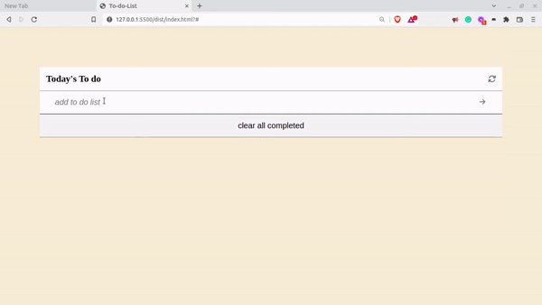

# Title-Info
> This project is basically a to do list application. Where we can add, remove and edit tasks.

# ScreenShots/GIF
- 

## Built With
- HTML
- CSS
- Javascript
- VScode

## Live Demo
For the link to the live demo, [Click here](https://tufahel.github.io/to-do-list/)

## Getting Started
To get a local copy up and running you just need to follow the following steps;
- Clone this repository with
git clone https://github.com/Tufahel/to-do-list.git using your terminal or command line.
- Run code . to open it in vscode
- Run "npm install"
- Run "npm run build"
- Run "npm start"
- Now site will automatically run into your default browser.

## Authors

👤 **Author**

- GitHub: [@Tufahel](https://github.com/Tufahel)
- LinkedIn: [Tufahel Ahmed](https://bd.linkedin.com/in/tufahel-ahmed-972884203)

## 🤝 Contributing

Contributions, issues, and feature requests are welcome!

Feel free to check the [issues page](../../issues/).

## Show your support

Give a ⭐️ if you like this project!
